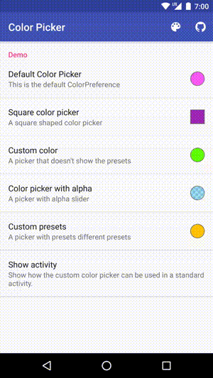

# Color Picker

</a>

<a target="_blank" href="https://developer.android.com/reference/android/os/Build.VERSION_CODES.html#ICE_CREAM_SANDWICH"></a>
<a target="_blank" href="LICENSE"></a>
<a target="_blank" href="https://maven-badges.herokuapp.com/maven-central/com.jrummyapps/colorpicker"></a>
<a target="_blank" href="http://www.methodscount.com/?lib=com.jrummyapps%3Acolorpicker%3A2.0.5"></a>
<a target="_blank" href="https://twitter.com/jrummyapps"></a>

Yet another open source color picker for Android. So, why should you use this color picker? It is highly customizable and easy to use. You can simply add the `ColorPreference` to your preferences and a beautiful color picker dialog will be displayed without additional code. The color picker supports alpha and allows you to set your own presets. [Try the demo app on appetize.io.](https://appetize.io/app/h1zukd6ux5yy5pw91vpyer32zr)

The original ColorPickerView was written by [Daniel Nilsson](https://github.com/danielnilsson9/color-picker-view).

## Screenshots

&nbsp;&nbsp;


## Usage

Add the `ColorPreference` to your preference XML:

```xml
<PreferenceScreen xmlns:android="http://schemas.android.com/apk/res/android"
                  xmlns:app="http://schemas.android.com/apk/res-auto">

  <PreferenceCategory>

    <com.jrummyapps.android.colorpicker.ColorPreference
        android:defaultValue="@color/color_default"
        android:key="default_color"
        android:summary="@string/color_default_summary"
        android:title="@string/color_default_title"/>

    ...

  </PreferenceCategory>

</PreferenceScreen>
```

You can add attributes to customize the `ColorPreference`:

| name            | type      | documentation                                                                         |
|-----------------|-----------|---------------------------------------------------------------------------------------|
| dialogType      | enum      | "custom" to show the color picker, "preset" to show pre-defined colors                |
| showAlphaSlider | boolean   | Show a slider for changing the alpha of a color (adding transparency)                 |
| colorShape      | enum      | "square" or "circle" for the shape of the color preview                               |
| colorPresets    | reference | An int-array of pre-defined colors to show in the dialog                              |
| dialogTitle     | reference | The string resource id for the dialog title. By default the title is "Select a Color" |
| showColorShades | boolean   | true to show different shades of the selected color                                   |
| allowPresets    | boolean   | true to add a button to toggle to the custom color picker                             |
| allowCustom     | boolean   | true to add a button to toggle to the presets color picker                            |
| showDialog      | boolean   | true to let the ColorPreference handle showing the dialog                             |

You can also show a `ColorPickerDialog` without using the `ColorPreference`:

```java
ColorPickerDialog.newBuilder().setColor(color).show(activity);
```

All the attributes above can also be applied to the `ColorPickerDialog`. The activity that shows the dialog should implement `ColorPickerDialogListener` to get a callback when a color is selected.

For further doumentation about how to use the library, check the [demo](demo) app included in this project.

## Download

Download [the latest AAR](https://repo1.maven.org/maven2/com/jrummyapps/colorpicker/2.0.5/colorpicker-2.0.5.aar) or grab via Gradle:

```groovy
compile 'com.jrummyapps:colorpicker:2.0.5'
```
or Maven:
```xml
<dependency>
  <groupId>com.jrummyapps</groupId>
  <artifactId>colorpicker</artifactId>
  <version>2.0.5</version>
  <type>aar</type>
</dependency>
```

## License

    Licensed under the Apache License, Version 2.0 (the "License");
    you may not use this file except in compliance with the License.
    You may obtain a copy of the License at

       http://www.apache.org/licenses/LICENSE-2.0

    Unless required by applicable law or agreed to in writing, software
    distributed under the License is distributed on an "AS IS" BASIS,
    WITHOUT WARRANTIES OR CONDITIONS OF ANY KIND, either express or implied.
    See the License for the specific language governing permissions and
    limitations under the License.
